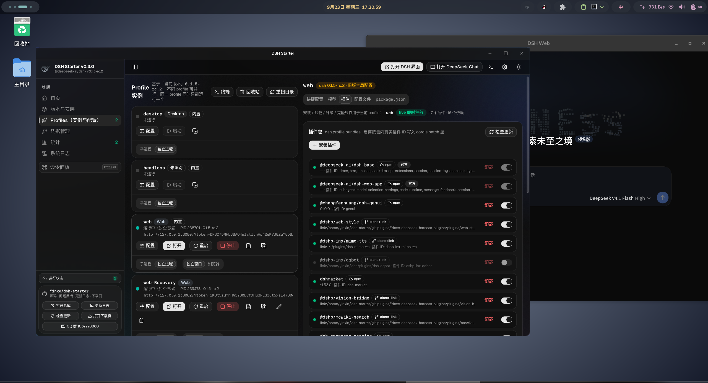
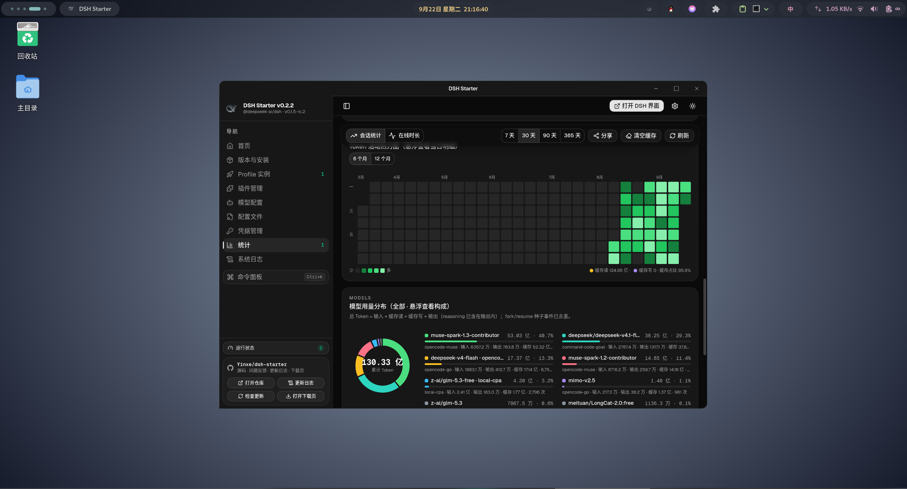

# DSH Starter

跨平台的 [@deepseek-ai/dsh](https://www.npmjs.com/package/@deepseek-ai/dsh)（DeepSeek Harness CLI）启动器。

技术栈：**Tauri 2**（Rust 系统层 + 托盘/窗口）+ **React 18 + TypeScript**（界面）+ **Node.js / npm**（构建工具链，dsh 本身也是 Node 程序）。






> **只想下载？** 产品页与各平台直链：**<https://yinxe.github.io/dsh-starter/>**
> （GitHub Pages，自建源 / GitHub 源可切换，版本号与体积由页面现拉）。
> 页面源码在 [`site/`](site/)，push 到 `main` 自动部署（见 [.github/workflows/pages.yml](.github/workflows/pages.yml)）。

## 功能

- **官方版本列表**：直接从 npm registry 拉取 `@deepseek-ai/dsh` 已发布的全部版本（含 `latest` / `next` / `alpha` dist-tags、发布日期、体积），支持切换 registry 镜像。列表按卡片实际宽度响应：窄窗口下把次要操作收进行尾「更多」菜单、按宽度收起「发布日期 / 大小」两列，行长与列宽都不会换行或横向溢出。
- **识别已安装版本**：三个来源自动合并识别——
  - 本启动器管理的 `~/.dsh-starter/versions/`；
  - npm 全局安装（`npm root -g`）；
  - PATH 中的 `dsh` 可执行文件（顺着符号链接解析版本）。
- **逐版本看 dsh 更新日志**：版本表每行（以及工具栏）都有「更新日志」，点开是版本浏览器——左栏列全部版本（有官方 Release 的带绿点，早期没建 Release 的标「无发布说明」），右栏渲染该版本的 GitHub Release 正文（小标题 + 条目原样排版），官方的中英双段可切「中文 / English」，底部可跳「完整提交对比」。数据一次拉全量后落盘缓存（`~/.dsh-starter/dsh-releases.json`，长期有效）：重开应用、反复翻版本都不再消耗 GitHub 匿名额度，对话框标题栏的「刷新」按钮是唯一的强制拉取入口；翻版本零等待；仓库是 monorepo，Release tag 形如 `dsh-v0.1.6-alpha.2`，只取 `dsh-` 前缀的那些。npm 的 packument 里没有 changelog，所以更新日志只能来自 Release；匿名额度不够时在设置里填 GitHub Token 即可。
- **安装 / 卸载 / 重装**：未安装的版本由启动器用 npm 装进自己的数据目录（互不污染全局环境），`--loglevel info` 把每个包的真实 fetch/resolve/extract 过程实时显示在安装卡里，可取消；卸载即删除对应目录。
- **首次使用引导**：dsh 的数据目录（`$DSH_HOME`，缺省 `~/.dsh`）是**第一次运行 dsh 时**才生成的，在那之前 profile 列表是空的，实例、快捷配置、模型与插件全都无从下手。启动器会在装完版本后提示「还差一步」，并在「Profiles」页给出一张引导卡（含 Node / dsh / npm 就绪状态），一键以 `dsh web`（等价 `--profile web`）完成初始化；dsh 写出 `profiles/web`、配置与凭据文件后，profile 列表与默认 profile 会自动就位。
- **首页（侧栏第一项，默认落地页）**：三张卡片——**DeepSeek Harness**（内置 `web` profile）一键启动/停止/重启/打开界面/配置，实时显示状态与访问地址，鲸鱼 logo 与波浪水印装饰、渐变标题；**DeepSeek Chat** 卡在应用内独立窗口打开官方对话（可多开）；最后是「**环境信息**」卡，OS/架构、Node、npm、当前 dsh 版本一卡看全，整卡可点直达「版本与安装」。dsh 未初始化时该页直接给出初始化引导。顶栏另有常驻的「打开 DeepSeek Chat」按钮。
- **命令面板（⌘K / Ctrl+K）**：侧栏「命令面板」按钮或快捷键呼出居中搜索面板，汇总三类命令——导航（6 个页面）、操作（打开 DSH 界面、刷新实例/Profile/版本清单、检查更新、开关终端面板、打开设置）与外观（深色/浅色/跟随系统），输入关键词即时过滤，↑↓ 选择、Enter 执行、Esc 关闭。启动/停止/重启与按 profile 的「打开工作台」不进面板（动作有确认框与在途守卫，去首页或 Profiles 卡片上点）。
- **通用终端面板（顶栏「终端」，右侧常驻栏）**：实例实时日志、插件安装/卸载/升级、dsh 版本安装、内置 Node 安装四类终端任务统一收进右侧同一个面板——上方纵向任务列表按「实例 / 插件任务 / 系统任务」分组（状态点、进度与耗时一行看全），下方是选中任务的输出区：逐行按流着色、自动滚底、可复制/导出到 `~/.dsh-starter/logs/`。宽屏点顶栏「终端」右栏滑入（与内容并排、不遮挡），启动实例或开始任何安装时自动展开并聚焦该任务；小窗口（<1280px）自动切换为侧边抽屉（覆盖式，不挤占内容宽度）。面板顶部「清理」一次收走全部已结束任务；插件任务运行中可就地取消/重试/「允许构建脚本并重试」，dsh 版本安装可就地取消。原先分散的「实例终端」抽屉、插件页内置终端、版本页安装日志卡与 Node 安装的滚动日志行全部由它取代。
- **启动方式默认独立进程（后台常驻）、且每个 profile 独立**：「启动」把 dsh 作为**独立于启动器**的进程拉起——关闭/退出启动器后 DSH 继续运行，重开启动器会自动扫描识别，「终端面板」里可看它的日志尾部（日志写入 `~/.dsh-starter/instance-logs`）。每张 profile 卡片底部都有该 profile 自己的「启动方式」开关，可随时切回**子进程模式**（日志实时回传「终端面板」，退出启动器即结束该 dsh 进程），不同 profile 互不影响，未单独设置过的跟随默认值；也可点「终端」在独立系统终端中启动（交互式 TUI 场景，不受启动器生命周期管理）。**每个 profile 同时只能运行一个实例**（子进程、独立进程与终端启动都受约束），Profile 选择器默认选中 `web`（不存在则取第一个），不提供“默认 profile”空选项。
- **Profile 绑定启动版本（换版本前先确认风险）**：每个 profile 会记住上一次真正把它跑起来的 dsh 版本，未运行的实例行上显示为「上次 dsh x.y.z」（首页卡片同样显示）。用与它不同的版本启动时 —— 也就是在「版本」页切换当前版本之后，无论升级还是降级 —— 点「启动」不会直接拉起 dsh，而是弹出一条精简警告：「dsh 启动版本与上次不一致，可能因插件或配置不兼容导致启动失败」，并给出三个选择：**取消**（不启动、记录不变，下次仍提示）；**复制 profile 试用启动**（推荐，打开复制框并预填 `<原名>-try`，复制成功后直接启动这份副本——跑不起来原实例也不受影响，验证无碍后再把原 profile 换版本跑）；**同意风险，强制启动**（照常拉起，并把该版本记为新的绑定版本，同样的组合不再重复提示）。从没启动过的 profile 首次启动不提示。只有启动器自己拉起的实例（内嵌 / 独立进程）活过 15 秒才计入绑定，所以「换上去就崩」的坏版本不会把提示静默掉；终端里手工跑的实例版本识别不出，也不会误改记录。绑定关系存在 `~/.dsh-starter/profile-versions.json`，profile 改名 / 删除时随之更新。
- **Web 界面打开方式（profile 卡片上的「打开方式」，仅 Web 类型显示）**：默认在应用内**独立窗口**打开 DSH 界面——没有浏览器地址栏，像桌面版一样直接用；一个地址只有一个窗口（再次点击是把已有窗口聚焦前置），多个实例同时运行时可以各开一个窗口并排使用。想回到浏览器打开，把该 profile 卡片上的「打开方式」切到**浏览器**即可（每个 profile 独立设置，未单独设置过的跟随默认值，对顶栏「打开 DSH 界面」、首页、实例列表与终端面板的所有入口生效）。独立窗口每次打开页面时会在界面脚本运行前自动清除 `dsh.*` 的本地存储项，因此**从高版本 dsh 切回低版本后页面不再因读不懂新数据的本地存储而白屏**（代价是这些键里保存的登录态/偏好也会被清掉，需要重新登录）。打开时也不再白屏刺眼：窗口按当前主题预铺底色并隐藏创建，页面从**第一帧**起就盖着与主题同色的「正在加载…」进度条（在界面脚本运行前注入，大体积前端包也不会露出白底），检测到页面真正渲染出内容后淡出移除；加载超过 5 秒仍会亮出窗口（显示实际内容或错误），超过 10 秒无内容遮罩也会强制让位，不会一直挡着。
- **Node 运行时预装**：宿主机没有 Node/npm 时，一键下载 Node LTS 安装到 `~/.dsh-starter/runtime/`（用户级、无需 root、不污染系统），下载默认走 npmmirror 镜像站（设置中可换 aliyun 等），npm registry 在设置中配置。
- **选择启动**：任意已安装版本一键在**新的系统终端窗口**中启动对应版本的 `dsh`（用绝对 node + bin.js 启动，不依赖 PATH）；支持 **profile**：顶栏下拉框列出 `$DSH_HOME/profiles`（缺省 `~/.dsh/profiles`，兼容单数 `profile/`）下的所有 profile（自动跳过 `node_modules`），选中即以 `dsh --profile <名字>` 启动并可保存为默认，留空则不带 `--profile` 走 dsh 默认。可设置默认附加参数（如 `--preset qqbot`）。
- **插件管理（Profiles 工作台的「插件」Tab）**：按 profile 管理 dsh bundle 插件——列出已装插件与启用状态并可一键启停（启停按包内真实插件 ID 写入 cordis.patch 层）；profile 由左列选定的实例决定，不再在插件页里二次下拉选择。
  - **全部走官方 `dsh plugin` 命令**：安装 = `dsh plugin --profile <p> add <spec>`，卸载 = `remove`，升级同样回到 `add`（git 克隆源则先 `git pull` 再重新 `link:` 安装），启动器从不直接改写 `package.json` / `dsh.profile.bundles`。
  - **实时输出在通用终端面板**：安装 / 卸载 / 升级 / 克隆的 stdout+stderr 逐行实时流入右侧终端面板（每行按流着色、自动滚底、可复制 / 导出到 `~/.dsh-starter/logs/`），任务开始时面板自动展开并聚焦；运行中可一键取消（取消会杀掉整棵进程组，pnpm/node 派生的孙进程不会残留），失败可就地重试，面板重挂载后历史仍在；插件页顶部只留「N 个插件任务进行中… 在终端中查看」状态条与跳转。同一 profile 同时只允许一个插件任务，避免并发写坏 `node_modules`。
  - **三种安装方式**：① npm 包（registry 搜索 / 精确规格，按版本号检测更新）② 链接直装（本地 `link:` 路径、仓库插件链接、`.tgz` 直链——原样交给 `dsh plugin add`，**不做任何远端探测**，也就没有版本渠道，只能手动重装同一来源）③ clone 仓库 + 本地 link（克隆到 `~/.dsh-starter/git-plugins/<owner>-<repo>`，可选自动 `pnpm install` + `pnpm run build`，更新方式 = 该目录 `git pull`；「本地克隆仓库」卡片里每个子包的 `link` 安装都会先弹确认框，写明目标 profile、来源仓库（分支/提交/本地改动）、子包路径与 `link:…` 安装规格，缺 `lib/` 构建产物会警告「装后校验会卸掉」并指路先 `git pull` 构建，未声明 `dsh.bundle` 的候选则直接置灰不可点）。
  - **探测只在 clone 路径上，且基于真实工作树**：点「探测」= 先把仓库克隆（或同步）到本地，再扫描这棵工作树（`pnpm-workspace.yaml` / `package.json workspaces` 识别 monorepo 子包，逐个给出名称 / 版本 / 描述 / 是否声明 `dsh.bundle` / `lib/` 是否就绪）。这样候选列表与 `lib/` 判定就是安装要用的那份目录本身。之前基于 jsDelivr 文件索引的探测已下线：那份索引是边缘缓存快照（实测某仓库只回 119 个文件 / 4 个子包，真实分支是 353 个文件 / 9 个插件），会出现「候选少几个」和「明明有 `lib/` 却判缺失」的偏差，还会据此误拦能装的包。GitHub 直装现在只做「远端可匿名访问」的轻量预检（`git ls-remote` 级别），能不能加载交给装后校验。
  - **GitHub 加速（前缀代理）**：把 github 链接原样拼到代理前缀后面即可，例如 `git clone https://gh-proxy.com/https://github.com/owner/repo.git`。内置一组常用前缀（gh-proxy.com / gh.xxooo.cf / gh.dpik.top / gh.927223.xyz / ghfast.top / ghproxy.net），设置里可固定用哪一个、也可补自建前缀。**首次使用自动测速并缓存 6 小时**：下载能力用小文件 GET 计时，git 能力用一次真实的 `git clone --depth 1 --filter=blob:none` 计时——两者分开测是必要的，代理是否放行 git（clone 403）会随网络和时段变化，不能只看下载测速。注入方式：git 走 `url.<前缀>https://github.com/.insteadOf`（因此**已有克隆的 `git pull` 也生效**；命令行文本仍是原始地址，所以安装页会单独写出「实际请求」那一行，任务日志里也会逐条列出实际请求地址；`git@github.com:` 这类 SSH 地址不在改写范围内，要走加速请填 https 地址），releases / raw 等直链在安装前直接改写为代理链接。只对 github 域名生效。**前缀只存在于进程内，永不写进仓库配置**：clone 用的是原始地址，粘进来带前缀的地址会被自动还原，已有的克隆在 fetch/pull 前也会把 `origin` 修回 `https://github.com/...` —— 所以代理失效或换域名只会退回直连，不会像手改 remote 那样把克隆永久卡死。
  - **安装 / 卸载的前后置校验**（细节对齐同生态的 dshmarket）：装完立刻核对新增的包——缺 `dsh` 清单、或没有可加载入口（源码检出、构建被 `allowBuilds` 拦住）会在**下次启动**把整个 profile 拖挂，因此当场卸掉并说明原因；新增包与被装插件的 loader **entry id 冲突**（cordis 不允许同 id 两个 insert，装错会让 dsh 起不来）也会被检出并卸掉。卸载前先查用户自己的 `cordis.patch.yml` 是否仍引用该包（引用则拒绝并指出要删哪几行，启动器不改写你的补丁文件）、是否带原生模块（`.node` 在进程退出前不会释放，需重启才能重装）；卸载后以**磁盘事实**对账：包没了却还在 `package.json` 里留着依赖/bundle 行的，删掉残留行（原件备份为 `package.json.starter-bak`），包还在的就保留行并提示重试。升级后还会比对实际安装版本——pnpm 的 `minimumReleaseAge` 会**静默保留旧版本并退出 0**，版本没变会明确告警而不是报成功。pnpm 失败按 dshmarket 的清单一次性恢复：新版本等待期放行（`--config.minimum-release-age=0`，短横线拼写，camelCase 在 pnpm ≥12.3 会被静默忽略）、网络抖动重跑、下载超时加长、宿主 peer 关闭自动安装、node_modules 布局/store 不匹配先重建——全部仍经由 `dsh plugin`。
  - **更新检测（同样零 API 额度）**：npm 包比对 registry `latest`；`github:` 规格与 clone+link 源都走 `git ls-remote` 比对提交（同一仓库的多个插件共用一次查询，结果缓存 60s；实测真实 profile 的 16 个依赖 ≈13s、GitHub API 调用 **0 次**），clone+link 源支持一键 `git pull` 升级；远端不可匿名访问（私有仓库）时明确标注 `私有仓库 · 不支持` 并提示在本地仓库手动 `git pull`；纯本地 link 与 `.tgz` 直链标注「无更新渠道」，只能手动重装。
- **配置文件 / 内嵌 YAML 编辑器（工作台的「配置文件」Tab）**：该 profile 的 `cordis.patch.yml`（0.1.7+ 主配置）、旧版全局 `$DSH_HOME/settings.yaml`（仅旧版 profile 可编辑，标注弃用）与 `package.json` 都用同一个 CodeMirror 6 编辑器——语法高亮、行号、括号匹配、折叠、行内 YAML 报错（带「第 X 行第 Y 列」的错误清单，**有语法错误时保存按钮直接禁用**，写入前后端还会做一次权威校验），Tab 缩进等必坏写法当场标出，Ctrl/Cmd+S 保存，编辑保留注释，写前自动备份。迁移时被归档的旧全局配置（`settings.yaml.imported`）提供**只读**查看入口。**高度自适应**：内容多高就多高（只改几行时不再顶着一大片空白），封顶在「它上方在滚动容器里还剩多少高度」——长配置能填满窗口并在编辑器内滚动，不会把整页顶长、拖出双滚动条；窗口缩放、上方说明换行都会即时重算。
- **模型配置（工作台的「模型」Tab，按 profile 读写）**：参考 dsh 官方 provider 配置布局，结构化编辑模型两节——`llm-pi-ai.providers`（API 密钥 / 显示名称 / API 地址 / API 协议 / 模型列表）与 `agent-default-model`（默认模型三级联动：Provider → 模型 → 思考等级，不选则保持默认）。绑定了 ≥0.1.7 版本的 profile 读写**自己的** `cordis.patch.yml`（只接管这两个条目，其余条目与节外内容逐字节保留）；旧版 profile 仍读写全局 `settings.yaml` 并提示弃用。API 密钥可下拉选择已有凭据或手动输入（手动输入的密钥保存时自动回存到「凭据管理」）；支持「获取可用模型」——从服务方 `GET {baseURL}/models` 拉取列表勾选添加（openai / anthropic 协议，密钥按 手动值 > 凭据 refs > 环境变量 解析）；模型的思考等级（reasoningEfforts）可补充映射，不填则不写入。另有「同步到其他 profile…」：勾选其它 ≥0.1.7 的 profile 批量写入同一份模型配置，旧版目标自动置灰跳过、失败逐个列明原因。写前自动备份，未识别字段原样透传。
- **凭据管理（含注释）**：管理 `$DSH_HOME/.credentials.yaml` 的 `refs`（各处按名字引用的 API Key / 令牌），支持增删改、复制、显示明文；列表只显示名称与长度，值仅在详情弹窗里可见。**每条凭据可以带一行注释**：约定就是文件里键**正上方那一行 `# 注释`** —— 已有的注释会被读出来显示在列表里，在列表里点注释格就能就地改（回车 / 失焦提交、Esc 取消），留空即删掉那一行；添加 / 编辑弹窗里也有注释字段。保存采用**逐行改写 refs 块**：`records`、`version`、未知顶层键以及它们自己的注释（含小节注释、records 段说明）全部逐字节保留，写前自动备份、文件权限自动收紧为仅本用户可读写。**外部修改防覆盖**：页面读取时记下文件指纹，若保存前发现文件被 dsh 等其它程序改过（或删除），写入会被拒绝并提示先「还原」再编辑，不会静默覆盖。交互上：切到别的页面未保存的编辑仍保留，「还原」丢改动前先确认，Ctrl/Cmd+S 快捷保存，凭据较多时可按名称/注释过滤，双击行开详情。
- **统计（会话 Token 用量 + 在线时长 + 分享导出）**：侧栏「统计」页读取本机 dsh 会话日志（`$DSH_HOME/sessions/`，**只读**）聚合用量，口径与社区插件 token-meter 一致（input+output+cacheRead+cacheWrite；同请求采样被终值覆盖；fork/resume 会话按会话继承标记切分去重）。**会话统计**标签给出全历史总览（总量、输入/输出/缓存、请求数、活跃天数、当前/最长连续打卡、峰值日、最大单请求、日均）、近 7/30/90/365 天按日模型堆叠趋势（悬浮出当日合计与各模型明细）、今日 24 小时分布、Token 活动热力图（绿色阶、默认 6 个月可切 12 个月、自适应宽度不溢出、低用量日也清晰可见，悬浮出当日总消耗/输入输出/缓存读写/最忙模型）与模型用量分布卡（环形图 + 全模型响应式网格，悬浮看输入/输出/缓存构成）；**在线时长**标签按「相邻事件间隔 ≤ 阈值即同一段在线」估算在线：「空闲阈值」卡并排展示 1/5/15/30/60 分钟五档的累计值与相对当前档的增量（推荐 15 分，切档直接读缓存秒出），「时间范围」（近 14/30/90 天/全部）只作用于每日图表与排行；今日在线、累计在线、活跃日均、对话进行中、模型生成、工具执行、引擎合计逐项标注「精确/估算/下界」，底部「口径与准确性」表逐条说明每个数字的算法与可信度；时长一律按小时显示。首次全量扫描后按文件指纹（大小+mtime）增量缓存于 `~/.dsh-starter/session-stats-cache.json`（正在写入的日志不入缓存），之后打开秒级出图；该缓存删掉可自动重建，不影响任何数据。**分享**按钮将总览、在线时长与模型用量分布渲染为响应式报表（随窗口宽度自动降列、最宽 1280px，署名取本地 git 身份），导出 2× 高分辨率 PNG，可一键复制到剪贴板或下载。
- **系统日志（应用内排查）**：侧栏「系统日志」页直接浏览启动器自身的分类日志（app / instance / install / runtime / plugin / profile / network / ui / panic 一个文件一类问题）：分类切换带文件大小、级别（DEBUG/INFO/WARN/ERROR）与关键词过滤、2 秒自动刷新跟随最新、一键复制本屏，还可**一键清除此分类 / 全部日志**（确认后删除并回收磁盘，下次写入自动重建）；**日志级别在页内下拉即选即生效**（存进设置，无需重启；`DSH_STARTER_LOG` 环境变量存在时优先并标出「锁定」）。原先只在设置抽屉里的「打开日志目录」「生成诊断包」也挪到了这一页，诊断包生成后直接在弹窗里看全文、一键复制。详见「日志与排查」。
- **通道自检**：设置页可一键并发探测四条通道（`github.com` refs / jsDelivr / raw / `api.github.com`）的可达性与往返延迟，直接看清当时哪条通、多快。每条通道记录最近成功延迟（EWMA）与连续失败次数：任一通道连续失败 2 次会被**临时跳过 5 分钟**，到期自动半开，避免每次都白等一个超时（自检按钮会清空熔断状态）。每条通道记录最近成功延迟（EWMA）与连续失败次数：任一通道连续失败 2 次会被**临时跳过 5 分钟**，到期自动半开，避免每次都白等一个超时（自检按钮会清空熔断状态）。
- **GitHub Token（可选）**：设置里可填一个 token（或直接用 `GITHUB_TOKEN` / `GH_TOKEN` 环境变量），把 `api.github.com` 额度从匿名 60 次/小时 提到 5000 次/小时。插件安装与更新检测走 git / registry，不填也完全可用；设置页会显示当前额度与重置时间。
- **任务栏 / 托盘图标**：常驻托盘，左键切换窗口；右键菜单只有「打开主界面」与「退出」两项（profile 运行状态在主界面查看）；点关闭默认最小化到托盘（可在设置中改为直接退出）。
- **启动器单实例**：启动器自身同时只允许跑一个——重复双击图标/快捷方式（或从终端再敲一次）不会开出第二个窗口和第二个托盘图标，而是把已有实例的主窗口唤回前台（隐藏到托盘的也会被唤出），新进程随即退出。这是启动器进程级的守卫，与上面「每个 profile 只有一个 dsh 实例」是两层独立保护。
- **启动器自更新**（两条独立通道，二选一，互不冲突）：
  - **内置 Tauri updater（推荐，可在应用内直接安装）**：`tauri.conf.json` 的 `plugins.updater` 配好 `pubkey` / `endpoints` 后，启动时自动检查远端 `latest.json`，发现新版本弹横幅（版本号 + 更新说明摘要 + **「查看新特性」**）→ 用户点「下载并安装」才下载、校验签名、安装并重启；点「稍后」就什么都不做。签名不匹配会直接拒绝安装，所以更新源被劫持也无法投毒。设置里另有「发现新版本后自动下载安装并重启」，**默认关闭**——只有想全自动的人才开。
  - **更新说明从哪来**：横幅摘要与弹窗全文都取自该版本在 `CHANGELOG.md` 里的段落（CI 把它写进 GitHub Release 正文，`tauri-action` 再写进 `latest.json` 的 `notes`）。所以「新版有什么变化」不是发布时随手写的一句话，而是每次发版前必须写清的更新日志——缺失时 CI 直接失败，发不出去。弹窗里的全文按小节与列表排版，可直接从弹窗里下载安装。
  - **自建更新清单（只能跳转下载页）**：设置里填一个返回 `{ "version": "x.y.z", "notes": "...", "url": "https://..." }` 的 JSON 地址。**清单优先于内置 updater**：填了清单就不再走应用内安装。
  - **各安装形态的差异**（打包时 tauri-bundler 会把格式标记写进二进制，运行时据此选择安装方式）：

    | 形态 | 安装方式 | 需要授权 | 能否静默自动装 |
    | --- | --- | --- | --- |
    | AppImage | 自己替换那个文件（旧文件先备份，失败回滚） | 否 | ✅ |
    | .deb / .rpm | updater 调 `pkexec dpkg -i` / `rpm -U`（退 zenity/kdialog + sudo） | 是，弹密码框 | ❌（必须用户在场，所以不参与静默开关） |
    | Windows .exe / .msi | 启动 NSIS / MSI 安装器接管（本进程随后被结束） | 安装器自己提权 | ✅（passive 模式只显示进度条） |
    | macOS .app | 替换整个 .app bundle | 一般不需要 | ✅ |

  - 开发构建（`npm run app` / 未打包的二进制）没有格式标记，**不会**放开应用内安装——否则 updater 会把安装包字节写到开发二进制上；这种形态只提示有新版。
  - **可以走 GitHub 加速**：检查更新（拉 latest.json）和下载安装包都套用设置里的加速前缀，与 clone / 插件下载共用同一份测速结果（`githubAccel` 开关 + `githubProxy` 指定前缀）。代理不支持某个地址（如 ghfast.top 对 `api.github.com` 会 403）或中途断流时，会自动回退直连重试。安装包有签名校验，所以**经第三方代理也无法投毒**——代理改一个字节就验签失败。
  - latest.json 里的下载地址由 tauri-action 生成，形如 `api.github.com/.../releases/assets/<id>`；客户端在开加速时会把它也套上前缀（gh-proxy 认这种地址；ghfast 之类只认 `github.com/...` 的会 403，此时客户端会自动回退直连重试）。
- **侧栏底部：「运行状态」按钮 + 项目仓库卡片**：底部数据不再分散在主栏底栏与侧栏两处 —— 主栏那条状态栏已去掉，「官方源 / 数据目录 / 托盘提示」全部收进侧栏底部。环境信息常驻只剩一个「运行状态」按钮（带运行中实例数角标），点击后在侧栏旁边弹出 Popover 详情：一行一灯的环境状态（Node / npm / 当前 dsh 版本 / 运行中实例数）、「目录与源」（registry、启动器数据目录、版本目录、dsh 数据目录各排一行、左侧标签固定宽度对齐；路径自动缩成 `~/.dsh-starter/versions` 这类形式，完整值在悬停提示里，行尾悬停可一键复制）、终端面板入口与托盘提示。侧栏收起成图标栏时，四个状态灯同样可点击弹出这份详情。下面保持「项目仓库」卡片（源码 / 问题反馈 / 更新日志），一键打开 [Yinxe/dsh-starter](https://github.com/Yinxe/dsh-starter) 或其更新日志；卡片底部另有「QQ 群 1067778060」按钮，点击复制群号，去 QQ 搜群号加群反馈与交流。

## 配置体系（0.1.7 起按 profile 隔离）

dsh 自 `0.1.7-alpha.x` 起，设置不再放全局 `~/.dsh/settings.yaml`，而是**每个 profile 一份** `profiles/<名字>/cordis.patch.yml`：

- **一次性迁移**：某个 profile 第一次以 ≥0.1.7 启动时，dsh 会把旧全局 `settings.yaml` 的各节**导入一次**到该 profile 的 patch（写成 `- id: llm-pi-ai` / `- id: agent-default-model` / `- id: ui-theme` 这类条目），然后把 `settings.yaml` 改名为 `settings.yaml.imported` 归档。被导入拒绝的节只留在归档文件里——启动器的「配置文件」Tab 提供这份归档的**只读**查看入口。**注意 `.imported` 不是完整存档**（成功导入的节已搬进 patch）；删除承载迁移配置的 profile 前，启动器会在确认框里警示「全局 settings.yaml 缺失 + 该补丁是唯一完整副本」这一风险。
- **热更范围**：插件设置存于当前 profile patch 条目的 `config:` 里，只有插件声明了 `.volatile()` 的字段支持不重启生效（工作台的「插件」Tab 顶部有 live / startup 徽标），其余字段改完需重启实例。
- **启动器怎么改 patch**：模型配置与快捷配置写进 patch 时采用**marker 注释块整块接管**（`# dsh-starter: modelcfg` / `# dsh-starter: web-quick`），保存只替换自己接管的那一块——`!!js` 自定义标签行、qqbot/insert 等其余条目与节外注释逐字节不动。若 patch 里出现两份同名条目（比如又在 dsh 的设置表单里改过一次），页面会警示「后者生效」，保存时自动收敛为一份。
- **旧版兼容（<0.1.7）**：旧版 dsh 只认全局 `settings.yaml`，而迁移已把它改名。`settings.yaml` 缺失时，启动器在**旧版 profile 启动前、以及编辑它的模型/配置文件时**自动复制还原一份：优先 `settings.starter-bak`（启动器覆写 settings.yaml 前留下的**完整**快照），没有才退回 `settings.yaml.imported`（只含导入被拒绝的节的**残段**，不是完整存档）；两个源文件都不改动，toast 明示还原到哪。之后若再用 ≥0.1.7 启动别的 profile，dsh 会再次导入并改名——这是官方的一次性行为，还原↔改名可能循环出现，属正常。旧版的全局配置能力将随 0.1.6 之前的版本支持一并弃用。
- **并发写风险（已知并接受）**：dsh 自己的设置表单 / 配置编辑器也会写同一份 `cordis.patch.yml`，启动器保存与其之间没有文件锁；两边写入各自原子落盘且启动器保存前都留 `*.starter-bak` 备份，真踩上「后保存覆盖先保存」时从备份找回即可。
- **恢复模式模板**：`web-Recovery` 从官方 `web` 模板新建时若模板 patch 已带启动器的 marker 块，会一并继承（providers/快捷配置同源），符合预期。

## 自动更新是怎么工作的

```
你 push 一个 tag / 手动触发 CI
        ↓  tauri-action 打包三端产物
   用私钥给每个产物签名 → 生成 .sig
        ↓
   生成 latest.json（version + 各平台下载地址 + 签名）并上传到同一个 Release
        ↓
用户机器上的启动器启动时 GET 这个 latest.json
        ↓
   版本比自己新？ → 下载对应平台安装包 → 用内置公钥验签 → 安装 → 重启
```

关键点只有三个：**私钥在 CI**（签名）、**公钥在安装包里的 `tauri.conf.json`**（验签）、**`latest.json` 必须能通过 HTTPS 匿名访问**。

下载地址默认走**自建 CDN**：清单由自建源（Cloudflare R2）提供，地址是
`…/latest/windows-x64-setup.exe` 这类**不带版本号的固定地址**（每次发布覆盖，桶里只留一份
「当前最新」）；地址里的名字只是「稳定键」，**下载下来的文件仍保留原始名字**
（如 `DSH.Starter_0.2.0_x64-setup.exe`，由 `Content-Disposition` 响应头给出）—— 键求稳定、
名求可读，两者互不干扰。GitHub 源保留为兜底，也可以在设置里手动切过去。实测国内直连（不走代理）拉 81MB 的
AppImage：GitHub release 直接连不上，自建源约 3.3MB/s 正常下载。地址写死在程序里，发布细节见
[docs/RELEASING.md](docs/RELEASING.md) 第 7 节。


## 日志与排查

侧栏「系统日志」页把排查闭环搬进了应用内：按分类浏览各日志尾部（一个文件一类问题）、
按级别（DEBUG/INFO/WARN/ERROR）与关键词过滤、2 秒自动刷新跟随最新输出，并可一键
复制本屏、清除此分类 / 全部清除日志（确认后删除当前与滚动文件，下次写入自动重建）、
打开日志目录与生成诊断包。日志级别也在这里设置 —— 保存后**立即生效、
无需重启**（存进 `settings.json` 的 `logLevel`）。

所有日志按**子系统分类**落在 `~/.dsh-starter/logs/`，一行一条，格式统一：

```
2026-09-21T01:23:45.678Z run=1789953825 pid=1234 +210ms ERROR install 启动 npm 失败：C:\Program Files\nodejs\npm
```

- `run=` 是本次启动的标识（秒级时间戳）：同一个文件里混着多次启动，先按它分组再看；
- `+Nms` 是距进程启动的毫秒数：排查卡顿/白屏时看阶段间隔比看绝对时间有用；
- 级别可 grep：`grep ERROR install.log`。默认记 INFO 及以上；需要逐次细节（端口归属判定、
  每条外部命令）时，在「系统日志」页把级别调到 DEBUG 即可（当场生效）。常驻轮询不刷流水：
  进程枚举看门狗只在首轮记一条 INFO、异常/超时记 WARN，正常轮不留痕。
  环境变量 `DSH_STARTER_LOG=debug|warn|error` 仍可用，且**优先于应用内设置**：它存在时
  级别被锁定，页面会标出「环境变量锁定」。

| 文件 | 内容 |
| --- | --- |
| `app.log` | 生命周期：启动横幅与各阶段耗时、托盘、设置读写（token 值永不落盘）、环境探测、应用内自更新（下载/验签/安装） |
| `instance.log` | dsh 实例：内嵌/独立/外部实例的启动与终端窗口启动、发现、归属判定、停止与清理 |
| `install.log` | dsh 版本：安装（npm 完整命令、PATH、退出码、stderr）、取消后的半成品清理、卸载、切换版本、profile 绑定版本的记录与迁移 |
| `runtime.log` | 内置 Node：下载字节数、每次解压尝试的命令与 stderr、runtime 目录快照 |
| `plugin.log` | 插件：任务执行的命令、失败步骤的退出码与输出尾部、清单修复（package.json 去幽灵依赖） |
| `profile.log` | profile：重命名、删除（进回收站）、恢复等变更，配置读写，凭据读写与保存冲突检测（只记键名，绝不记值） |
| `network.log` | 网络：registry 拉取与搜索、版本列表/更新日志/GitHub API 请求（含失败与额度耗尽）、免额度通道连续失败后的临时停用与恢复、模型列表拉取、渠道探测与 GitHub 加速测速的结果与失败原因 |
| `ui.log` | 前端报错：`window.onerror`、未处理的 Promise、报错 toast |
| `panic.log` | 崩溃：位置、线程、回溯（release 版是 Windows GUI 程序，这是唯一线索） |

单个文件超过 1MB 自动滚动一份 `.1`（只留一代，不会无限增长）；也可以随时在「系统日志」页
一键清除（单分类或全部），清完立刻释放磁盘，日志系统会自行重建文件。

**报 bug 时**用「系统日志」页的「生成诊断包」：它把环境摘要、设置（**凭据已脱敏**）、全部日志
尾部合并成一个 `diagnostics-<run>.txt`，并**直接在弹窗里展示全文**——顶部一键复制或打开所在
目录即可，不必逐个回答「node 装哪了」「npm 是哪个」。日志目录里也保留了从终端面板导出的插件任务日志。

## 数据目录

```
~/.dsh-starter/       # 启动器自身数据
├── settings.json      # 启动器设置
├── github-accel.json  # GitHub 加速：测速选出的代理前缀（缓存 6 小时）
├── dsh-releases.json  # dsh 更新日志磁盘缓存（长期有效，正常打开不消耗 GitHub 额度）
├── session-stats-cache.json # 会话统计的按文件指纹增量缓存（可删，自动重建）
├── runtime/           # 内置 Node 运行时（一键预装）
│   └── node-v22.14.0/
├── logs/              # 分类日志（侧栏「系统日志」页直接看，见下表）
├── git-plugins/       # clone+link 安装的本地仓库（git pull 更新）
│   └── owner-repo/
└── versions/
    └── 0.1.5-rc.2/    # 每个版本一个 npm prefix
        └── node_modules/@deepseek-ai/dsh/

~/.dsh/                # dsh 自身数据（$DSH_HOME，可被环境变量覆盖）
└── profiles/          # dsh 的可启动 profile（子目录；兼容旧版单数 profile/）
    ├── web/
    ├── headless/
    └── ci.yaml        # → dsh --profile ci
```

## 本地开发

前置：Node.js ≥ 18、npm、Rust 工具链（rustup），Linux 需要 WebKit/GTK 系统依赖：

```sh
# Debian/Ubuntu
sudo apt install libwebkit2gtk-4.1-dev build-essential curl wget file \
  libxdo-dev libssl-dev libayatana-appindicator3-dev librsvg2-dev

# Arch
sudo pacman -S webkit2gtk-4.1 base-devel libxdo libayatana-appindicator librsvg

# Fedora
sudo dnf install webkit2gtk4.1-devel libappindicator-gtk3-devel librsvg2-devel
```

运行 / 打包（统一走 Tauri CLI）：

```sh
npm install
npm run app            # 开发模式（tauri dev，vite 热更新）
npm run build:debug    # 调试版二进制（内嵌前端，不产安装包）
npm run build:release  # 正式打包：产出当前平台支持的全部安装包
npm run release        # 同上（别名）
```

`bundle.targets` 为 `"all"`，即打包**当前平台支持的全部格式**：

| 平台 | 产物 |
| --- | --- |
| Linux | `.deb` / `.rpm` / `.AppImage` |
| Windows | NSIS `.exe` 安装包 / `.msi` |
| macOS | `.app` / `.dmg`（配 `--target universal-apple-darwin` 出 Intel + Apple Silicon 通用包） |

产物落在 `src-tauri/target/release/bundle/`。只想出其中几种就覆盖 `--bundles`，例如
`npm run build:release -- --bundles deb,appimage`；只要裸二进制（不打包）加 `--no-bundle`。

前端单独构建检查：`npm run build`（tsc + vite）。

> Linux 编译与运行都依赖上面安装的 WebKit/GTK 系统库；cargo 依赖下载已配置国内镜像（`src-tauri/.cargo/config.toml`，只影响本项目）。
> Tauri 2 的 rpm 打包是**纯 Rust** 实现（内置 `rpm` crate），不需要系统安装 `rpm` / `rpmbuild`，Debian/Ubuntu 上可直接产出 `.rpm`。

### 下载页（GitHub Pages）

`site/` 是一份独立的 **Vite + React + shadcn/ui + Tailwind v4** 站点：介绍产品、给出各平台安装包直链，
并把 README 里的功能按领域铺成一张「全部能力」清单。与主程序共用品牌色与字体（Geist / Geist Mono / Archivo），
但不共享构建产物，互不影响。**默认亮色主题**（右上角可切暗色，选择记在 localStorage 里；
首帧主题由 `index.html` 的内联脚本决定，避免闪光）。

```sh
cd site && npm ci
npm run dev      # 本地预览
npm run build    # tsc 类型检查 + 构建到 site/dist
```

根目录也有快捷方式：`npm run site:dev` / `npm run site:build`。

**页面不写死版本号**：打开时并行请求自建源清单（`latest.json`）与 GitHub Release API，
用拿到的版本号现算两条源各自的直链 —— 所以发新版后不需要重新构建页面。

两点值得记住的边界：

- **自建源桶没配 CORS**，浏览器读不到清单内容（只探得到「可达」）。这**不影响下载**，也不影响启动器
  （它走 Rust 的 HTTP 客户端，不受 CORS 约束），页面因此改用 GitHub Release 的正文与体积数据。
  若给桶配上 CORS（允许 `https://yinxe.github.io` 的 GET/HEAD），把
  `site/src/lib/release.ts` 里的 `R2_CORS_ENABLED` 改成 `true`，页面就会改读自建源清单并核对两条源是否同步。
- **macOS 的 .dmg 不在自建源上**（发布流程只把 `latest.json` 里出现的平台键同步到 R2，`.dmg` 只存在于
  GitHub Release），所以 DMG 那一行在自建源模式下会标明「自建源未托管」并指向 GitHub。

部署：`.github/workflows/pages.yml` —— push 到 `main` 且改动 `site/**` 时构建并发布。
首次需要在仓库 **Settings → Pages** 把 Source 选成 *GitHub Actions*（工作流里的 `configure-pages`
带了 `enablement: true`，通常会自动打开）。站点按项目路径部署，Vite 用相对 `base: "./"`，
将来绑自定义域也不用改配置。

## 发布新版本（启动器自身）

### 第一次：一次性配置（约 5 分钟）

1. **生成签名密钥对**（只做一次，之后所有版本复用同一对）：

   ```bash
   npm run tauri signer generate -w ~/.tauri/dsh-starter.key
   # 会打印一串 base64 公钥，并把私钥写进 ~/.tauri/dsh-starter.key
   # 提示输入密码时可以直接回车（留空）
   ```

   > 0.2.0 改名**不需要重新生成密钥**：沿用原来那份私钥即可（旧文件名叫
   > `~/.tauri/dsh-launcher.key`，改个文件名就行）。换密钥 = 公钥变了 =
   > 已装版本的更新全部验签失败。

   > 私钥 = 更新权限。**不要提交进仓库**，丢了就只能让老用户手动重装（新私钥签的包老版本验不过）。
   > 公钥是烧进安装包里的，所以改公钥 / 改 endpoints **必须重新发版**；只有已经装着「带新公钥」那版的人才能自动升级——再往后的版本就都能滚动了。

2. **把公钥写进 `src-tauri/tauri.conf.json`**，并把 endpoints 指向你的 Release：

   ```jsonc
   "plugins": {
     "updater": {
       "pubkey": "<上一步打印的公钥>",
       "endpoints": [
         "https://github.com/<你的账号>/<仓库名>/releases/latest/download/latest.json"
       ],
       "windows": { "installMode": "passive" }
     }
   }
   ```

3. **在 GitHub 仓库加两个 Secret**（Settings → Secrets and variables → Actions）：

   | Secret | 值 |
   | --- | --- |
   | `TAURI_SIGNING_PRIVATE_KEY` | `~/.tauri/dsh-starter.key` 文件的**完整内容**（含 `untrusted comment:` 那一行） |
   | `TAURI_SIGNING_PRIVATE_KEY_PASSWORD` | 生成时设的密码；留空则填一个空字符串 |

   > `bundle.createUpdaterArtifacts` 已经是 `true`：**这两个 secret 没配好，CI 打包会直接失败**（找不到签名密钥）。暂时不想启用应用内更新，就把它改回 `false`。

### 之后每次发版（三件事，都在 git 里完成）

1. **写 `CHANGELOG.md`**：在 `[Unreleased]` 下面加上 `## [新版本号] - 日期` 段落，写清用户能看到的变化
   （这段文字就是 GitHub Release 正文与客户端「查看新特性」弹窗的内容，也是唯一来源）；
2. **三处版本号改成同一个**：`src-tauri/tauri.conf.json`、`src-tauri/Cargo.toml`、`package.json`
   —— 不一致时 CI 会直接失败（`npm run notes:check` 可本地先查）；
3. **归档 + 提交**：`npm run notes:archive` 生成 `docs/releases/vX.Y.Z.md`，连同上面的改动一起合进 **main** 并 push
   —— workflow 是 `on: push: branches: [main]`，推上去就自动打包 → 传产物 → 发布正式 Release。**不需要去网页点任何按钮**。

> 本地自检：`npm run notes`（预览即将发出去的 Release 正文）、`npm run notes:check`（版本号一致性 + 本版说明是否存在）。
> 更详细的规范、发布后核对清单与常见故障见 [`docs/RELEASING.md`](docs/RELEASING.md)。

版本号没改就推 main 也不会白跑：workflow 第一步会查到该版本已发布，直接跳过后面的构建（绿勾 + 一条 notice）；
但轻量的「规范门禁」作业仍会跑一遍前端构建与 CHANGELOG 校验，几十秒就能暴露「忘了写更新说明」。

> **为什么 workflow 里非要「先草稿、再自动发布」两步**：三端是并发跑的，如果直接发布，先跑完的那个会把 release 发出去，另外两个找不到草稿就去创建 → `422 already_exists(tag_name)`，结果是**整个平台的产物都缺失**（踩过一次：初版 v0.1.1 少了全部 Linux 包）。官方模板的做法是停在 Draft 让你手动点 Publish；这里只是把最后那一步自动化了，并在发布前按 CHANGELOG 再刷一遍正文。

> **别把 release 标成 pre-release**。GitHub 的 release 只有三种状态，而 `releases/latest` 只认「non-draft + non-prerelease」：
>
> | 状态 | 在 GitHub 界面上怎么得到 | `releases/latest` 指向它吗 |
> | --- | --- | --- |
> | Draft 草稿 | 新建 release 的默认状态；要点 **Publish release** 才离开 | ❌ 匿名访问不到 |
> | Pre-release 预发布 | 「Release label」单选组里选 `Pre-release` | ❌ 会被跳过 |
> | 正式 release | 「Release label」选 **`None`** —— 界面里**没有**叫 "Release" 的选项，因为「正式」就是不贴任何标签，`None` 就是它 | ✅ |
>
> 也就是说那个单选组只是「贴标签」，「是不是草稿」由按钮决定（显示 `Update release` 就说明已经发布过了）。实测过一次：只标了 pre-release 的 v0.1.0 会让 `gh api repos/<你>/<仓库>/releases/latest` 返回 `Not Found`、`.../releases/latest/download/latest.json` 返回 404。
>
> 想发测试版请用**单独的 tag + 单独的 endpoints**，不要动正式通道。包要是坏了，删掉 release 和 tag、重跑一次 CI 即可。

发完用这两条自查（第二条应能打印出版本号）：
```bash
gh api repos/<你的账号>/<仓库名>/releases/latest --jq .tag_name
curl -sL https://github.com/<你的账号>/<仓库名>/releases/latest/download/latest.json | head -c 80
```

本地打包（不走 CI）则 `npm run build:release`，前提是当前 shell 里有 `TAURI_SIGNING_PRIVATE_KEY` / `TAURI_SIGNING_PRIVATE_KEY_PASSWORD`。

> **三端全格式交给 CI**：`.github/workflows/release.yml` 基于 Tauri [官方模板](https://v2.tauri.app/distribute/pipelines/github) + `tauri-apps/tauri-action@v1`——打标签、建 Draft Release、上传产物、生成 `latest.json` 全部由该 action 完成（`includeUpdaterJson: true`）。
> 触发方式：push 到 `main` 或手动（`workflow_dispatch`）；版本号取自 `src-tauri/tauri.conf.json`（与 `Cargo.toml`、`package.json` 三处必须一致）。
> Release 正文与 `latest.json` 的 `notes` 都取自 `CHANGELOG.md` 里本版本的段落，由 `scripts/release-notes.mjs` 提取（缺失即失败）。
> matrix 覆盖 ubuntu-22.04（deb/rpm/AppImage）、windows-latest（.exe/.msi）、macos-latest（universal .dmg）。
> 跨平台产物无法在单机上交叉编译，Windows / macOS 安装包必须由对应 runner 产出。

### 不用 GitHub Releases 行不行

行。任何能匿名 HTTPS 访问的地方都行（对象存储 / 自己的服务器 / CDN）：把 `endpoints` 指向你托管的 `latest.json`，格式是

```json
{
  "version": "0.2.0",
  "notes": "把 `npm run notes` 的输出贴进来（与 CHANGELOG.md 同源，别手写第二份）",
  "pub_date": "2026-01-01T00:00:00Z",
  "platforms": {
    "windows-x86_64": { "signature": "<.sig 文件内容>", "url": "https://.../DSH-Starter_0.2.0_x64-setup.exe" },
    "darwin-aarch64": { "signature": "...", "url": "https://.../DSH.Starter_0.2.0_aarch64.dmg" },
    "linux-x86_64":   { "signature": "...", "url": "https://.../DSH-Starter_0.2.0_amd64.AppImage" }
  }
}
```

## 已知边界

- dsh 是交互式 CLI，启动器会在**系统终端**里拉起它（自动探测 gnome-terminal / konsole / alacritty / kitty / Terminal.app / Windows Terminal 等），无终端可用时界面会展示等效命令供手动粘贴。
- 全局 / PATH 安装的 dsh 只做识别与启动，不会代为卸载（避免误删用户环境）。
- Linux 托盘需要 `libayatana-appindicator3`（运行时依赖，打包的 deb 已声明系统会自带或按提示安装）。
