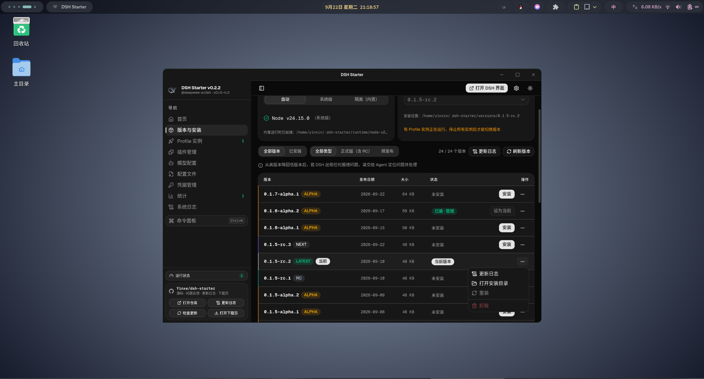

# DSH Launcher

跨平台的 [@deepseek-ai/dsh](https://www.npmjs.com/package/@deepseek-ai/dsh)（DeepSeek Harness CLI）启动器。

技术栈：**Tauri 2**（Rust 系统层 + 托盘/窗口）+ **React 18 + TypeScript**（界面）+ **Node.js / npm**（构建工具链，dsh 本身也是 Node 程序）。



## 功能

- **官方版本列表**：直接从 npm registry 拉取 `@deepseek-ai/dsh` 已发布的全部版本（含 `latest` / `next` / `alpha` dist-tags、发布日期、体积），支持切换 registry 镜像。
- **识别已安装版本**：三个来源自动合并识别——
  - 本启动器管理的 `~/.dsh-launcher/versions/`；
  - npm 全局安装（`npm root -g`）；
  - PATH 中的 `dsh` 可执行文件（顺着符号链接解析版本）。
- **安装 / 卸载 / 重装**：未安装的版本由启动器用 npm 装进自己的数据目录（互不污染全局环境），`--loglevel info` 把每个包的真实 fetch/resolve/extract 过程实时显示在安装卡里，可取消；卸载即删除对应目录。
- **内嵌启动（默认）**：「启动」把 dsh 作为启动器的**子进程**运行——日志实时显示在底部进程面板（多实例 tab、运行时长、停止按钮），**退出启动器即结束所有 dsh 进程**；也可点「终端」在独立系统终端中启动（交互式 TUI 场景，不受启动器生命周期管理）。**每个 profile 同时只能运行一个实例**（内嵌与终端启动都受约束），Profile 选择器默认选中 `web`（不存在则取第一个），不提供“默认 profile”空选项。
- **Node 运行时预装**：宿主机没有 Node/npm 时，一键下载 Node LTS 安装到 `~/.dsh-launcher/runtime/`（用户级、无需 root、不污染系统），下载默认走 npmmirror 镜像站（设置中可换 aliyun 等），npm registry 在设置中配置。
- **选择启动**：任意已安装版本一键在**新的系统终端窗口**中启动对应版本的 `dsh`（用绝对 node + bin.js 启动，不依赖 PATH）；支持 **profile**：顶栏下拉框列出 `$DSH_HOME/profiles`（缺省 `~/.dsh/profiles`，兼容单数 `profile/`）下的所有 profile（自动跳过 `node_modules`），选中即以 `dsh --profile <名字>` 启动并可保存为默认，留空则不带 `--profile` 走 dsh 默认。可设置默认附加参数（如 `--preset qqbot`）。
- **插件管理**：按 profile 管理 dsh bundle 插件——列出已装插件与启用状态并可一键启停（启停按包内真实插件 ID 写入 cordis.patch 层），也可直接编辑 profile 侧的配置文件并写回。
  - **全部走官方 `dsh plugin` 命令**：安装 = `dsh plugin --profile <p> add <spec>`，卸载 = `remove`，升级同样回到 `add`（git 克隆源则先 `git pull` 再重新 `link:` 安装），启动器从不直接改写 `package.json` / `dsh.profile.bundles`。
  - **内置终端**：插件页顶部常驻可折叠终端，安装 / 卸载 / 升级 / 克隆的 stdout+stderr **逐行实时**输出（每行按流着色、自动滚底、可复制 / 导出到 `~/.dsh-launcher/logs/`）；每个任务一个标签页，运行中可一键取消（取消会杀掉整棵进程组，pnpm/node 派生的孙进程不会残留），窗口重挂载后历史仍在。同一 profile 同时只允许一个插件任务，避免并发写坏 `node_modules`。
  - **三种安装方式**：① npm 包（registry 搜索 / 精确规格，按版本号检测更新）② 链接直装（本地 `link:` 路径、仓库插件链接、`.tgz` 直链——原样交给 `dsh plugin add`，**不做任何远端探测**，也就没有版本渠道，只能手动重装同一来源）③ clone 仓库 + 本地 link（克隆到 `~/.dsh-launcher/git-plugins/<owner>-<repo>`，可选自动 `pnpm install` + `pnpm run build`，更新方式 = 该目录 `git pull`）。
  - **探测只在 clone 路径上，且基于真实工作树**：点「探测」= 先把仓库克隆（或同步）到本地，再扫描这棵工作树（`pnpm-workspace.yaml` / `package.json workspaces` 识别 monorepo 子包，逐个给出名称 / 版本 / 描述 / 是否声明 `dsh.bundle` / `lib/` 是否就绪）。这样候选列表与 `lib/` 判定就是安装要用的那份目录本身。之前基于 jsDelivr 文件索引的探测已下线：那份索引是边缘缓存快照（实测某仓库只回 119 个文件 / 4 个子包，真实分支是 353 个文件 / 9 个插件），会出现「候选少几个」和「明明有 `lib/` 却判缺失」的偏差，还会据此误拦能装的包。GitHub 直装现在只做「远端可匿名访问」的轻量预检（`git ls-remote` 级别），能不能加载交给装后校验。
  - **GitHub 加速（前缀代理）**：把 github 链接原样拼到代理前缀后面即可，例如 `git clone https://gh-proxy.com/https://github.com/owner/repo.git`。内置一组常用前缀（gh-proxy.com / gh.xxooo.cf / gh.dpik.top / gh.927223.xyz / ghfast.top / ghproxy.net），设置里可固定用哪一个、也可补自建前缀。**首次使用自动测速并缓存 6 小时**：下载能力用小文件 GET 计时，git 能力用一次真实的 `git clone --depth 1 --filter=blob:none` 计时——两者分开测是必要的，实测 gh-proxy.com 只放行文件下载、clone 会 403，而 gh.xxooo.cf / gh.dpik.top / ghfast.top / ghproxy.net / gh.927223.xyz 五种都支持 git。注入方式：git 走 `url.<前缀>https://github.com/.insteadOf`（因此**已有克隆的 `git pull` 也生效**，命令本身仍显示原始地址），releases / raw 等直链在安装前直接改写为代理链接。只对 github 域名生效。
  - **安装 / 卸载的前后置校验**（细节对齐同生态的 dshmarket）：装完立刻核对新增的包——缺 `dsh` 清单、或没有可加载入口（源码检出、构建被 `allowBuilds` 拦住）会在**下次启动**把整个 profile 拖挂，因此当场卸掉并说明原因；新增包与被装插件的 loader **entry id 冲突**（cordis 不允许同 id 两个 insert，装错会让 dsh 起不来）也会被检出并卸掉。卸载前先查用户自己的 `cordis.patch.yml` 是否仍引用该包（引用则拒绝并指出要删哪几行，启动器不改写你的补丁文件）、是否带原生模块（`.node` 在进程退出前不会释放，需重启才能重装）；卸载后以**磁盘事实**对账：包没了却还在 `package.json` 里留着依赖/bundle 行的，删掉残留行（原件备份为 `package.json.launcher-bak`），包还在的就保留行并提示重试。升级后还会比对实际安装版本——pnpm 的 `minimumReleaseAge` 会**静默保留旧版本并退出 0**，版本没变会明确告警而不是报成功。pnpm 失败按 dshmarket 的清单一次性恢复：新版本等待期放行（`--config.minimum-release-age=0`，短横线拼写，camelCase 在 pnpm ≥12.3 会被静默忽略）、网络抖动重跑、下载超时加长、宿主 peer 关闭自动安装、node_modules 布局/store 不匹配先重建——全部仍经由 `dsh plugin`。
  - **更新检测（同样零 API 额度）**：npm 包比对 registry `latest`；`github:` 规格与 clone+link 源都走 `git ls-remote` 比对提交（同一仓库的多个插件共用一次查询，结果缓存 60s；实测真实 profile 的 16 个依赖 ≈13s、GitHub API 调用 **0 次**），clone+link 源支持一键 `git pull` 升级；远端不可匿名访问（私有仓库）时明确标注 `私有仓库 · 不支持` 并提示在本地仓库手动 `git pull`；纯本地 link 与 `.tgz` 直链标注「无更新渠道」，只能手动重装。
- **模型配置**：参考 dsh 官方 provider 配置布局，结构化编辑全局配置的模型两节——`llm-pi-ai.providers`（API 密钥 / 显示名称 / API 地址 / API 协议 / 模型列表）与 `agent-default-model`（默认模型三级联动：Provider → 模型 → 思考等级，不选则保持默认）。API 密钥可下拉选择已有凭据或手动输入（手动输入的密钥保存时自动回存到「凭据管理」）；支持「获取可用模型」——从服务方 `GET {baseURL}/models` 拉取列表勾选添加（openai / anthropic 协议，密钥按 手动值 > 凭据 refs > 环境变量 解析）；模型的思考等级（reasoningEfforts）可补充映射，不填则不写入。保存只重写这两节，`settings.yaml` 其余内容与节外注释逐字节保留，写前自动备份，未识别字段原样透传。
- **通道自检**：设置页可一键并发探测四条通道（`github.com` refs / jsDelivr / raw / `api.github.com`）的可达性与往返延迟，直接看清当时哪条通、多快。每条通道记录最近成功延迟（EWMA）与连续失败次数：任一通道连续失败 2 次会被**临时跳过 5 分钟**，到期自动半开，避免每次都白等一个超时（自检按钮会清空熔断状态）。
- **GitHub Token（可选）**：设置里可填一个 token（或直接用 `GITHUB_TOKEN` / `GH_TOKEN` 环境变量），把 `api.github.com` 额度从匿名 60 次/小时 提到 5000 次/小时。插件安装与更新检测走 git / registry，不填也完全可用；设置页会显示当前额度与重置时间。
- **任务栏 / 托盘图标**：常驻托盘，左键切换窗口；右键菜单为「打开主界面」+ 各 profile 的运行状态（● 运行中 / ○ 未运行，纯展示不可点击）+ 退出；点关闭默认最小化到托盘（可在设置中改为直接退出）。
- **启动器自更新**（两条独立通道，二选一，互不冲突）：
  - **内置 Tauri updater（推荐，可在应用内直接安装）**：`tauri.conf.json` 的 `plugins.updater` 配好 `pubkey` / `endpoints` 后，启动时自动检查远端 `latest.json`，发现新版本弹横幅（显示版本号 + 更新说明）→ 用户点「下载并安装」才下载、校验签名、安装并重启；点「稍后」就什么都不做。签名不匹配会直接拒绝安装，所以更新源被劫持也无法投毒。设置里另有「发现新版本后自动下载安装并重启」，**默认关闭**——只有想全自动的人才开。
  - **自建更新清单（只能跳转下载页）**：设置里填一个返回 `{ "version": "x.y.z", "notes": "...", "url": "https://..." }` 的 JSON 地址。**清单优先于内置 updater**：填了清单就不再走应用内安装。
  - **各安装形态的差异**（打包时 tauri-bundler 会把格式标记写进二进制，运行时据此选择安装方式）：

    | 形态 | 安装方式 | 需要授权 | 能否静默自动装 |
    | --- | --- | --- | --- |
    | AppImage | 自己替换那个文件（旧文件先备份，失败回滚） | 否 | ✅ |
    | .deb / .rpm | updater 调 `pkexec dpkg -i` / `rpm -U`（退 zenity/kdialog + sudo） | 是，弹密码框 | ❌（必须用户在场，所以不参与静默开关） |
    | Windows .exe / .msi | 启动 NSIS / MSI 安装器接管（本进程随后被结束） | 安装器自己提权 | ✅（passive 模式只显示进度条） |
    | macOS .app | 替换整个 .app bundle | 一般不需要 | ✅ |

  - 开发构建（`npm run app` / 未打包的二进制）没有格式标记，**不会**放开应用内安装——否则 updater 会把安装包字节写到开发二进制上；这种形态只提示有新版。
  - **可以走 GitHub 加速**：检查更新（拉 latest.json）和下载安装包都套用设置里的加速前缀，与 clone / 插件下载共用同一份测速结果（`githubAccel` 开关 + `githubProxy` 指定前缀）。代理不支持某个地址（如 ghfast.top 对 `api.github.com` 会 403）或中途断流时，会自动回退直连重试。安装包有签名校验，所以**经第三方代理也无法投毒**——代理改一个字节就验签失败。
  - latest.json 里的下载地址由 tauri-action 生成，形如 `api.github.com/.../releases/assets/<id>`；客户端在开加速时会把它也套上前缀（gh-proxy 认这种地址；ghfast 之类只认 `github.com/...` 的会 403，此时客户端会自动回退直连重试）。

## 自动更新是怎么工作的

```
你 push 一个 tag / 手动触发 CI
        ↓  tauri-action 打包三端产物
   用私钥给每个产物签名 → 生成 .sig
        ↓
   生成 latest.json（version + 各平台下载地址 + 签名）并上传到同一个 Release
        ↓
用户机器上的启动器启动时 GET 这个 latest.json
        ↓
   版本比自己新？ → 下载对应平台安装包 → 用内置公钥验签 → 安装 → 重启
```

关键点只有三个：**私钥在 CI**（签名）、**公钥在安装包里的 `tauri.conf.json`**（验签）、**`latest.json` 必须能通过 HTTPS 匿名访问**。


## 数据目录

```
~/.dsh-launcher/       # 启动器自身数据
├── settings.json      # 启动器设置
├── github-accel.json  # GitHub 加速：测速选出的代理前缀（缓存 6 小时）
├── runtime/           # 内置 Node 运行时（一键预装）
│   └── node-v22.14.0/
├── logs/              # 插件任务日志导出（内置终端「导出」按钮）
├── git-plugins/       # clone+link 安装的本地仓库（git pull 更新）
│   └── owner-repo/
└── versions/
    └── 0.1.5-rc.2/    # 每个版本一个 npm prefix
        └── node_modules/@deepseek-ai/dsh/

~/.dsh/                # dsh 自身数据（$DSH_HOME，可被环境变量覆盖）
└── profiles/          # dsh 的可启动 profile（子目录；兼容旧版单数 profile/）
    ├── web/
    ├── headless/
    └── ci.yaml        # → dsh --profile ci
```

## 本地开发

前置：Node.js ≥ 18、npm、Rust 工具链（rustup），Linux 需要 WebKit/GTK 系统依赖：

```sh
# Debian/Ubuntu
sudo apt install libwebkit2gtk-4.1-dev build-essential curl wget file \
  libxdo-dev libssl-dev libayatana-appindicator3-dev librsvg2-dev

# Arch
sudo pacman -S webkit2gtk-4.1 base-devel libxdo libayatana-appindicator librsvg

# Fedora
sudo dnf install webkit2gtk4.1-devel libappindicator-gtk3-devel librsvg2-devel
```

运行 / 打包（统一走 Tauri CLI）：

```sh
npm install
npm run app            # 开发模式（tauri dev，vite 热更新）
npm run build:debug    # 调试版二进制（内嵌前端，不产安装包）
npm run build:release  # 正式打包：产出当前平台支持的全部安装包
npm run release        # 同上（别名）
```

`bundle.targets` 为 `"all"`，即打包**当前平台支持的全部格式**：

| 平台 | 产物 |
| --- | --- |
| Linux | `.deb` / `.rpm` / `.AppImage` |
| Windows | NSIS `.exe` 安装包 / `.msi` |
| macOS | `.app` / `.dmg`（配 `--target universal-apple-darwin` 出 Intel + Apple Silicon 通用包） |

产物落在 `src-tauri/target/release/bundle/`。只想出其中几种就覆盖 `--bundles`，例如
`npm run build:release -- --bundles deb,appimage`；只要裸二进制（不打包）加 `--no-bundle`。

前端单独构建检查：`npm run build`（tsc + vite）。

> Linux 编译与运行都依赖上面安装的 WebKit/GTK 系统库；cargo 依赖下载已配置国内镜像（`src-tauri/.cargo/config.toml`，只影响本项目）。
> Tauri 2 的 rpm 打包是**纯 Rust** 实现（内置 `rpm` crate），不需要系统安装 `rpm` / `rpmbuild`，Debian/Ubuntu 上可直接产出 `.rpm`。

## 发布新版本（启动器自身）

### 第一次：一次性配置（约 5 分钟）

1. **生成签名密钥对**（只做一次，之后所有版本复用同一对）：

   ```bash
   npm run tauri signer generate -w ~/.tauri/dsh-launcher.key
   # 会打印一串 base64 公钥，并把私钥写进 ~/.tauri/dsh-launcher.key
   # 提示输入密码时可以直接回车（留空）
   ```

   > 私钥 = 更新权限。**不要提交进仓库**，丢了就只能让老用户手动重装（新私钥签的包老版本验不过）。
   > 公钥是烧进安装包里的，所以改公钥 / 改 endpoints **必须重新发版**；只有已经装着「带新公钥」那版的人才能自动升级——再往后的版本就都能滚动了。

2. **把公钥写进 `src-tauri/tauri.conf.json`**，并把 endpoints 指向你的 Release：

   ```jsonc
   "plugins": {
     "updater": {
       "pubkey": "<上一步打印的公钥>",
       "endpoints": [
         "https://github.com/<你的账号>/<仓库名>/releases/latest/download/latest.json"
       ],
       "windows": { "installMode": "passive" }
     }
   }
   ```

3. **在 GitHub 仓库加两个 Secret**（Settings → Secrets and variables → Actions）：

   | Secret | 值 |
   | --- | --- |
   | `TAURI_SIGNING_PRIVATE_KEY` | `~/.tauri/dsh-launcher.key` 文件的**完整内容**（含 `untrusted comment:` 那一行） |
   | `TAURI_SIGNING_PRIVATE_KEY_PASSWORD` | 生成时设的密码；留空则填一个空字符串 |

   > `bundle.createUpdaterArtifacts` 已经是 `true`：**这两个 secret 没配好，CI 打包会直接失败**（找不到签名密钥）。暂时不想启用应用内更新，就把它改回 `false`。

### 之后每次发版（两件事，都在 git 里完成）

1. 改 `src-tauri/tauri.conf.json` 的 `version` 和 `src-tauri/Cargo.toml` 的 `version`（两者保持一致）；
2. 把 dev 合进 **main** 并 push —— workflow 是 `on: push: branches: [main]`，推上去就自动打包 → 传产物 → 自动发布正式 Release。**不需要去网页点任何按钮**。

版本号没改就推 main 也不会白跑：workflow 第一步会查到该版本已发布，直接跳过后面的构建（绿勾 + 一条 notice）。

> **为什么 workflow 里非要「先草稿、再自动发布」两步**：三端是并发跑的，如果直接发布，先跑完的那个会把 release 发出去，另外两个找不到草稿就去创建 → `422 already_exists(tag_name)`，结果是**整个平台的产物都缺失**（踩过一次：初版 v0.1.1 少了全部 Linux 包）。官方模板的做法是停在 Draft 让你手动点 Publish；这里只是把最后那一步自动化了。

> **别把 release 标成 pre-release**。GitHub 的 release 只有三种状态，而 `releases/latest` 只认「non-draft + non-prerelease」：
>
> | 状态 | 在 GitHub 界面上怎么得到 | `releases/latest` 指向它吗 |
> | --- | --- | --- |
> | Draft 草稿 | 新建 release 的默认状态；要点 **Publish release** 才离开 | ❌ 匿名访问不到 |
> | Pre-release 预发布 | 「Release label」单选组里选 `Pre-release` | ❌ 会被跳过 |
> | 正式 release | 「Release label」选 **`None`** —— 界面里**没有**叫 "Release" 的选项，因为「正式」就是不贴任何标签，`None` 就是它 | ✅ |
>
> 也就是说那个单选组只是「贴标签」，「是不是草稿」由按钮决定（显示 `Update release` 就说明已经发布过了）。实测过一次：只标了 pre-release 的 v0.1.0 会让 `gh api repos/<你>/<仓库>/releases/latest` 返回 `Not Found`、`.../releases/latest/download/latest.json` 返回 404。
>
> 想发测试版请用**单独的 tag + 单独的 endpoints**，不要动正式通道。包要是坏了，删掉 release 和 tag、重跑一次 CI 即可。

发完用这两条自查（第二条应能打印出版本号）：
```bash
gh api repos/<你的账号>/<仓库名>/releases/latest --jq .tag_name
curl -sL https://github.com/<你的账号>/<仓库名>/releases/latest/download/latest.json | head -c 80
```

本地打包（不走 CI）则 `npm run build:release`，前提是当前 shell 里有 `TAURI_SIGNING_PRIVATE_KEY` / `TAURI_SIGNING_PRIVATE_KEY_PASSWORD`。

> **三端全格式交给 CI**：`.github/workflows/release.yml` 基于 Tauri [官方模板](https://v2.tauri.app/distribute/pipelines/github) + `tauri-apps/tauri-action@v1`——打标签、建 Draft Release、上传产物、生成 `latest.json` 全部由该 action 完成（`includeUpdaterJson: true`）。
> 触发方式：手动（`workflow_dispatch`）或 push 到 `release` 分支。版本号**可选**：填了走官方 `tauri build --config` 覆盖（不修改任何文件），留空则用 `tauri.conf.json` 里的版本。
> matrix 覆盖 ubuntu-22.04（deb/rpm/AppImage）、windows-latest（.exe/.msi）、macos-latest（universal .dmg）。
> 跨平台产物无法在单机上交叉编译，Windows / macOS 安装包必须由对应 runner 产出。

### 不用 GitHub Releases 行不行

行。任何能匿名 HTTPS 访问的地方都行（对象存储 / 自己的服务器 / CDN）：把 `endpoints` 指向你托管的 `latest.json`，格式是

```json
{
  "version": "0.2.0",
  "notes": "更新说明",
  "pub_date": "2026-01-01T00:00:00Z",
  "platforms": {
    "windows-x86_64": { "signature": "<.sig 文件内容>", "url": "https://.../DSH-Launcher_0.2.0_x64-setup.exe" },
    "darwin-aarch64": { "signature": "...", "url": "https://.../DSH.Launcher_0.2.0_aarch64.dmg" },
    "linux-x86_64":   { "signature": "...", "url": "https://.../DSH-Launcher_0.2.0_amd64.AppImage" }
  }
}
```

## 已知边界

- dsh 是交互式 CLI，启动器会在**系统终端**里拉起它（自动探测 gnome-terminal / konsole / alacritty / kitty / Terminal.app / Windows Terminal 等），无终端可用时界面会展示等效命令供手动粘贴。
- 全局 / PATH 安装的 dsh 只做识别与启动，不会代为卸载（避免误删用户环境）。
- Linux 托盘需要 `libayatana-appindicator3`（运行时依赖，打包的 deb 已声明系统会自带或按提示安装）。
